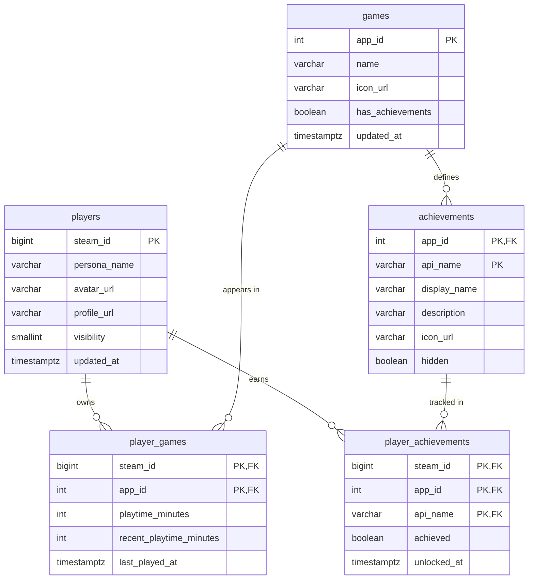

# Database Schema

PostgreSQL stores Steam data for the backend. Models live in `backend/app/models`, and migrations live in `backend/alembic/versions`.



## Tables

| Table | Contents | Primary Key |
| --- | --- | --- |
| `players` | One row per Steam profile | `steam_id` |
| `games` | One row per Steam app | `app_id` |
| `player_games` | A player's library entries and playtime | `steam_id`, `app_id` |
| `achievements` | Achievement definitions from each game's schema | `app_id`, `api_name` |
| `player_achievements` | A player's progress on each achievement | `steam_id`, `app_id`, `api_name` |

## Conventions

- `steam_id` is a 64-bit integer in the database and a string in API responses.
- Timestamps are stored in UTC.
- Playtime is stored in minutes.
- `last_played_at` and `unlocked_at` are null when Steam sends no value.
- Deleting a player or game also deletes its library, achievement, and progress rows.

## Changing the Schema

1. Edit the models in `backend/app/models`.
2. Create a migration:

   ```console
   docker compose exec backend alembic revision --autogenerate -m "describe the change"
   ```

3. Review the new file in `backend/alembic/versions`.
4. Apply it:

   ```console
   docker compose exec backend alembic upgrade head
   ```

5. Commit the model change and the migration together.

## Rules

- Never edit a migration after it is merged. Create a new one instead.
- Pull `main` before creating a migration. If `docker compose exec backend alembic heads` shows two heads after a merge, run `docker compose exec backend alembic merge heads -m "merge heads"`.
- `docker compose exec backend alembic check` confirms the models and migrations match.
- `docker compose down -v` followed by `docker compose up -d --build` rebuilds the database from the migrations.